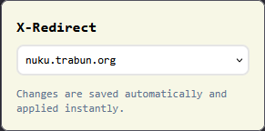

# X-Redirect

<p align="center">
    
    
</p>

A lightweight Firefox extension built with React and Vite that automatically redirects X (formerly Twitter) URLs to a custom destination like xcancel.com.

## Features
- **Automatic Redirect:** Intercepts `x.com` and `twitter.com` requests and swaps the domain while preserving the URL path.
- **Customizable:** Change the redirect target (e.g., to nitter.net) directly from the extension popup.
- **Privacy Focused:** Operates locally using the `browser.tabs` and `browser.storage` APIs.

## Getting Started

### Prerequisites
- [Bun](https://bun.sh/) installed on your machine.
- Firefox (Developer Edition recommended for permanent local installs).

### Installation & Development
1. **Install dependencies**
```bash
bun install 
```
2. **Run in development mode**
```bash
bun run dev
```
### Build
```powershell
.\build.ps1
```

The contents will be put in the out/ directory.

## Contributions

Contributions are welcome! Whether it's fixing a bug, adding a new redirect target to the default list, or improving the UI:

1. **Fork** the repository.
2. Create a **Feature Branch** (`git checkout -b feature/NewFeature`).
3. **Commit** your changes (`git commit -m 'Add some feature'`).
4. **Push** to the branch (`git push origin feature/NewFeature`).
5. Open a **Pull Request**.

For major changes, please open an issue first to discuss what you would like to change.
